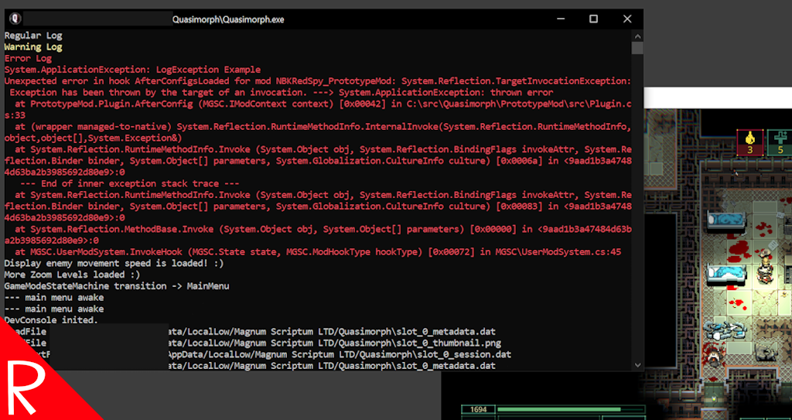

# Quasimorph External Log

A utility for developers.

Adds the "Unity External Log Window" to the game.
The project can be found here:  https://github.com/NBKRedSpy/Unity-External-Log-Window

Note that the window output will not contain any info prior to the game loading the mod.  However, that information can be found in Unity's player.log file.

# Support
If you enjoy my mods and want to buy me a coffee, check out my [Ko-Fi](https://ko-fi.com/nbkredspy71915) page.
Thanks!

# Source Code
Source code is available on GitHub at https://github.com/NBKRedSpy/QM_ExternalLog
